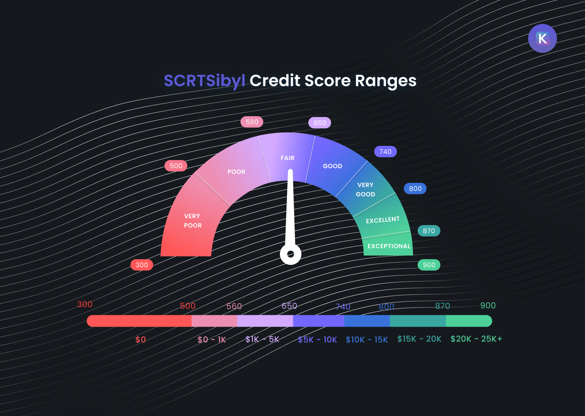

# 🚀 SCRT SYBIL


⚡️ This is the *credit score algorithm* Repo for our SCRTSibyl oracle. 

## At a Glance
SCRTSibyl is an oracle for credit score checks developed for the Secret Network. Our oracle returns a numerical, private, and encrypted credit score affirming users' credibility and trustworthiness within the Secret network ecosystem. We designed this dapp with one specific use case in mind: P2P micro-lending, which is facilitating lending and borrowing of microloans ranging between $1-25K USD. Running a credit score check on a user you are considering lending money to or borrowing money from, will inform you whether and how much a user can pay back upon loan issuance. 

The dapp works as follow: 
 - it acquires user's financial data by integrating with two validators ([Plaid](https://dashboard.plaid.com/overview) & [Coinbase](https://developers.coinbase.com/))
 - it runs an algorithm on given data to compute a score representing the financial health of a user
 - it writes the score to the Secret blockchain via a CosmWasm smart contract
 - it makes the score available to service providers (i.e., loan issuers) by releasing permission/viewing Secret keys. 

Ultimately, this will incentivize on-chain traffic, it will affirm the reputation of those users requesting a credit score, and it will execute a credit score check to validate their credibility, while also preserving their privacy. 

 ---


## Executing Locally 
 * download or clone the repo to your machine
 * install dependancies 
 * set up ```.env``` file 
 * execute 


### Package Manager Required :package:
npm or yarn

Run in local terminal following command:
```
git clone  ... my-project-name
cd my-project-name
yarn install
```


### Credentials Required :old_key: :lock:

You'll need to create a Developer Coinmarket Cap API Key, following the CoinMarketCap Developers guide [here.](https://coinmarketcap.com/api/documentation/v1/#section/Introduction)

Next, create a ```.env``` local file in your root folder: 

```
PLAID_CLIENT_ID=your_client_id
PLAID_CLIENT_SECRET=your_sandbox_key
PLAID_ACCESS_TOKEN=your_unique_access_token
PLAID_URL_SANDBOX="sandbox.plaid.com"

COINBASE_CLIENT_ID=your_client_Id
COINBASE_CLIENT_SECRET=your_client_secret

COINMARKETCAP_KEY=your_coinmarketcap_key
```


## Credit Score Model 

### Algorithm Architecture :page_facing_up:
Understand the credit score model at a glance. 

We developed two distinct models, one for each of our chosen validators, namely Plaid & Coinbase.

[**Plaid model**](./images/logic_plaid.png) diagram and features:
- :curling_stone: fetch 5 yrs transaction history in < 1 second
- :gem: select dynamically user's best credit card products
- :dart: smart detection of recurring deposits and withdrawals (monthly)
- :hammer_and_wrench: linear regression on minimum running balance past 24 months
- :magnet: auto-filter & discard micro transactions
- :pushpin: inspect loan, investment, saving accounts

[**Coinbase model**](./images/logic_coinbase.png) diagram and features:
- :bell: check for user KYC status
- :key: live fetch of top 20 cryptos via [CoinMarketCap](https://coinmarketcap.com/) API
- :fire: dynamic selection of user's best crypto wallets
- :closed_lock_with_key: real-time automatic conversion of any currency to USD
- :bulb: analyze all transactions since Coinbase account inception
- :moneybag: smart user's net profit calculator
 
 
  
## Interpret Your Score :mag:

SCRTSibyl returns to the user a numerical score ranging from 300-900 points. The score is partitioned into categorical bins describing qualitatively the score (see fuel gauge in diagram below) compared to average scores obtained by other users. Each bin is associated with a USD equivalent. This is the maximum amount of loan in USD the user qualified for based on the SCRTSibyl oracle calculation.




